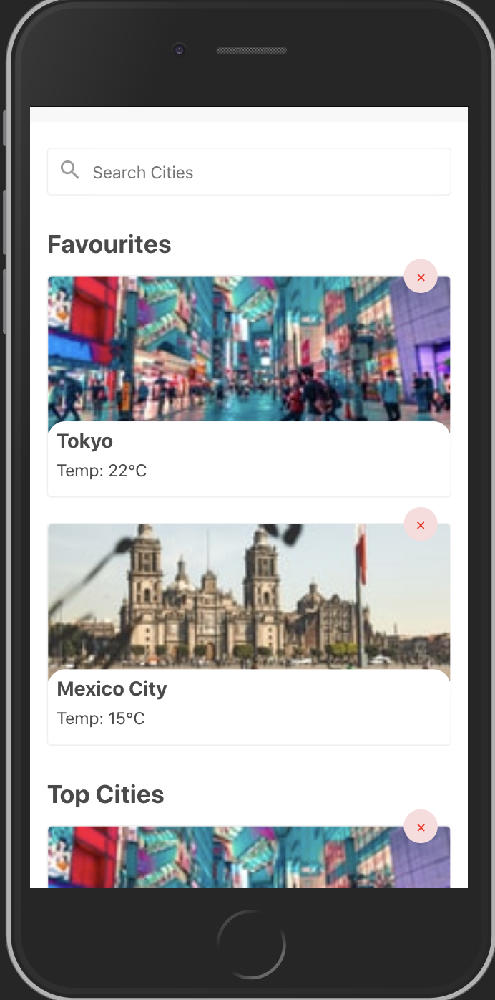
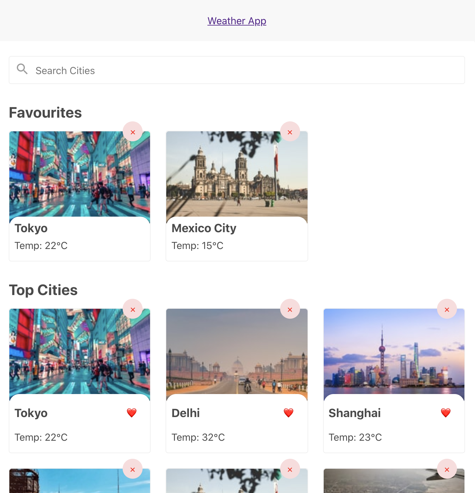
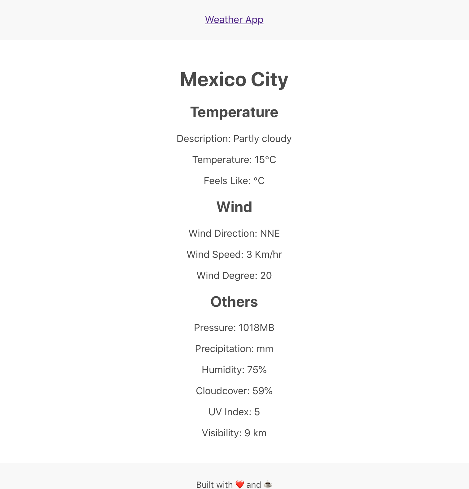

# Weather App

## Screenshots






## Local setup

### Install Project dependencies

- Clone this repo and open the root of the project in your terminal.
- Install dependencies by running the following command in your terminal.

```sh
yarn
```

If you use npm, run:

```sh
npm i
```

### Running the App

Before running the app, rename then `.env.sample` file to `.env` and add your API keys to the file.

To run the app (UI) in development mode, run:

```sh
yarn start
```

OR

```sh
npm start
```

The app would be launched on port **3000**.


### Building For Production

To create a production build, run:

```sh
yarn build
```

OR

```sh
npm run build
```

## Disclaimer

This project was bootstrapped with [Create React App](https://github.com/facebook/create-react-app).

You can learn more in the [Create React App documentation](https://facebook.github.io/create-react-app/docs/getting-started).

To learn React, check out the [React documentation](https://reactjs.org/).
